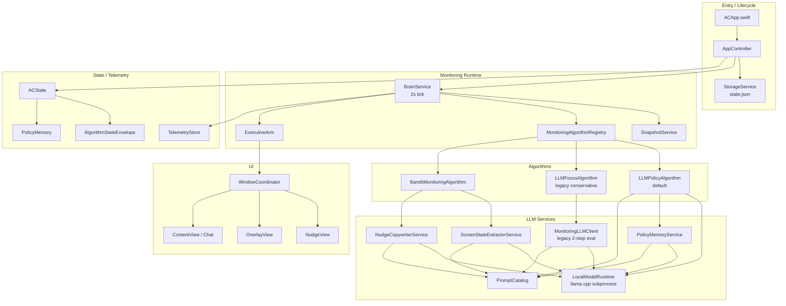
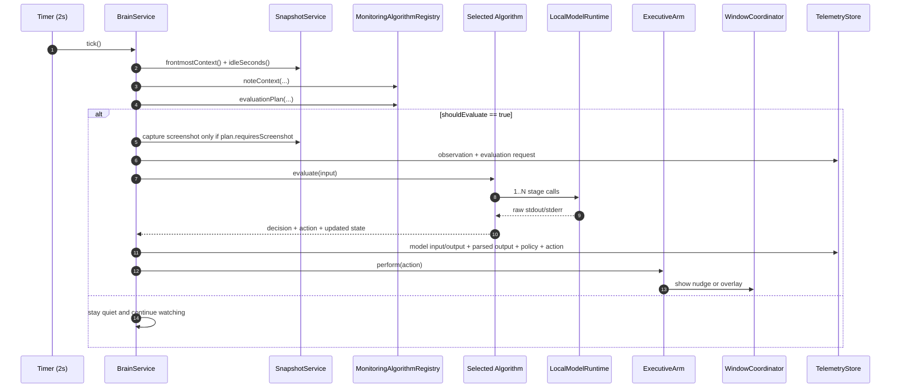

# AC System Overview

This document reflects the current shipped architecture in the repo as of April 2026.

The monitoring stack now has three production algorithms behind one seam:

- `llm_policy_v1`: default. Staged LLM policy pipeline with structured policy memory, profile-aware screenshot use, split decision/copy, and typed soft appeals.
- `llm_focus_v1`: legacy conservative LLM path. It now runs screenshot-to-description first, then a text-only decision step through the old ladder/policy gates.
- `bandit_focus_v1`: contextual bandit path. Vision extraction plus LinUCB action selection.

`legacy_focus_v1` still decodes from persisted state, but it is normalized to `llm_focus_v1` at runtime.

## 1. Runtime Architecture

## 2. Main Tick Flow

Important runtime behavior:

- `BrainService` does not branch on algorithm id. It asks the selected algorithm for an evaluation plan, then builds a snapshot only if needed.
- Screenshot capture is profile-aware. Title-only policy profiles do not capture screenshots.
- Telemetry records the effective algorithm, prompt profile, pipeline profile, and runtime profile in `MonitoringExecutionMetadata`.

## 3. Algorithms

### 3.1 `llm_policy_v1` (default)

This is the current primary production path.

Pipeline stages:

1. `perception_title`
2. `perception_vision` (optional, profile-dependent)
3. `decision`
4. `nudge_copy` (optional, only when the decision chose `nudge` and the profile uses split copy)
5. `appeal_review`
6. `policy_memory` updates for explicit and implicit feedback paths

Deterministic rails still exist, but they are intentionally small:

- obvious productive shortcuts
- stable-context gating
- distracted follow-up scheduling
- stale-context discard
- permission gating

The model owns semantic interpretation and primary action choice. Deterministic code only enforces safety and anti-spam.

`llm_policy_v1` currently records `lastNudgeAt` and `lastOverlayAt` in state, but explicit nudge/overlay cooldown suppression is not yet enforced in the algorithm path itself.

### 3.2 `llm_focus_v1`

This is the conservative legacy LLM path. It now uses a two-step structure:

1. screenshot -> concise activity description
2. text-only decision over that description plus memory, recent interventions, heuristics, and distraction state

After that, the old deterministic gates still apply:

- `DistractionLadder`
- `CompanionPolicy`

So this path is still not fully “LLM controls everything”. It is useful as a baseline and fallback comparison mode.

### 3.3 `bandit_focus_v1`

This path remains separate from the policy LLM.

Flow:

1. screenshot -> structured screen-state extraction
2. contextual bandit selects an arm
3. optional text-only nudge copy generation

The bandit still cannot directly reason over raw free-text user policy updates the way the policy LLM can. It learns from explicit and implicit reward signals on executed actions.

## 4. Shared State

### 4.1 `ACState`

Relevant fields now are:

- `monitoringConfiguration`
- `memory`: free-form chat/persona memory
- `policyMemory`: structured rules used by policy decisions and appeals
- `recentActions`
- `recentSwitches`
- `usageByDay`
- `algorithmState`

### 4.2 `AlgorithmStateEnvelope`

Per-algorithm slices:

- `llmFocus`
- `llmPolicy`
- `banditFocus`

`llmPolicy` now holds:

- current distraction state
- current context tracking
- last intervention timestamps
- recent nudge messages
- active typed appeal session metadata

### 4.3 `PolicyMemory`

Structured policy memory is separate from free-form memory.

It stores rules such as:

- allow / discourage / disallow / limit
- app and title scope
- time window / expiry
- allowed topics
- disallowed topics
- daily minute limit
- tone preference
- rule source and timestamps

The monitoring pipeline consumes a deterministic monitoring summary of active matching rules. The free-form chat memory is still preserved, but it is not the primary monitoring policy store anymore.

## 5. Monitoring Configuration

`MonitoringConfiguration` now carries:

- `algorithmID`
- `promptProfileID`
- `pipelineProfileID`
- `runtimeProfileID`
- `selectionMode`
- optional `experimentArmOverride`

Defaults:

- algorithm: `llm_policy_v1`
- pipeline: `vision_split_default`
- runtime: `gemma_balanced_v1`

Legacy note:

- `promptProfileID` is mainly relevant to the legacy `llm_focus_v1` path.
- `pipelineProfileID` and `runtimeProfileID` drive `llm_policy_v1`.

## 6. Pipeline Profiles

Current policy pipeline profiles:

- `vision_split_default`
- `title_only_default`
- `vision_single_call`
- `title_split_copy`

The main difference between them is whether screenshot perception is used and whether decision and nudge copy are split.

Permission impact:

- title-only profiles need Accessibility, but not Screen Recording
- vision-backed profiles need both Accessibility and Screen Recording

## 7. Runtime Profiles

Runtime profiles now define stage-specific `llama.cpp` options:

- model identifier
- max tokens
- temperature
- top-p
- top-k
- ctx-size
- batch size
- ubatch size
- timeout

Current built-in presets:

- `gemma_balanced_v1`
- `gemma_low_ram_v1`
- `llama_experiment_v1`

The balanced and llama presets now use larger context windows for the perception and decision stages than the previous implementation, because the staged prompts and policy context were overrunning smaller windows.

## 8. Prompting

### 8.1 Policy prompts

The current policy prompts are intentionally shorter than the first staged implementation, but more specific in the perception stages.

The perception prompts now explicitly ask for:

- what the user is doing right now
- which page / topic / video / conversation when visible
- whether they are scrolling, typing, replying, researching, watching, or coding

That means outputs should say things like:

- “Watching a YouTube SwiftUI state-management tutorial”
- “Scrolling Instagram Reels”
- “Replying in LinkedIn messages”
- “Reviewing a GitHub PR diff”

instead of generic summaries like “using Chrome”.

### 8.2 Legacy prompts

`llm_focus_v1` now shares the same style of screenshot perception prompt for the first step, then runs a shorter text-only decision prompt over the extracted description.

## 9. Appeals and Overlay

Overlay actions now carry an `OverlayPresentation` payload instead of a bare enum case.

That payload contains:

- headline
- body
- typed appeal prompt
- submit button title
- secondary button title
- evaluation id

Soft typed escalation flow:

1. decision stage chooses `overlay`
2. overlay asks for a typed justification
3. `appeal_review` returns `allow`, `deny`, or `defer`
4. `deny` stays soft in v1: the overlay remains and guidance is shown, but there is no hard enforcement loop

## 10. Telemetry

Telemetry now captures enough metadata to replay staged runs:

- observation
- evaluation request
- prompt payloads
- rendered prompts
- raw model outputs
- parsed outputs
- policy decision
- executed action
- user reactions
- annotations

For policy runs, telemetry also stores the effective:

- `promptProfileID`
- `pipelineProfileID`
- `runtimeProfileID`
- `experimentArm`

## 11. Inspector / Prompt Lab

`ACInspector` now has two tabs:

- episode browser
- Prompt Lab

Prompt Lab supports:

- telemetry-backed scenarios
- synthetic editable scenarios
- stage-by-stage prompt editing
- pipeline/runtime matrix replay
- side-by-side stage outputs
- per-result human annotations

Prompt Lab state is now persisted under the inspector support directory, so scenarios, prompt edits, run results, and replay annotations survive relaunches.

Prompt Lab is inspector-local on purpose:

- it reuses shared telemetry types
- it mirrors the production staged pipeline concepts
- it does not directly depend on the app target

## 12. Files to Start With

If you are tracing the current architecture, start here:

- [AC/Core/BrainService.swift](../AC/Core/BrainService.swift)
- [AC/Core/MonitoringAlgorithm.swift](../AC/Core/MonitoringAlgorithm.swift)
- [AC/Core/LLMPolicyAlgorithm.swift](../AC/Core/LLMPolicyAlgorithm.swift)
- [AC/Core/LLMFocusAlgorithm.swift](../AC/Core/LLMFocusAlgorithm.swift)
- [AC/Core/BanditMonitoringAlgorithm.swift](../AC/Core/BanditMonitoringAlgorithm.swift)
- [AC/Models/MonitoringModels.swift](../AC/Models/MonitoringModels.swift)
- [AC/Models/LLMPolicyProfileModels.swift](../AC/Models/LLMPolicyProfileModels.swift)
- [AC/Models/PolicyMemoryModels.swift](../AC/Models/PolicyMemoryModels.swift)
- [AC/Services/MonitoringLLMClient.swift](../AC/Services/MonitoringLLMClient.swift)
- [AC/Services/PolicyMemoryService.swift](../AC/Services/PolicyMemoryService.swift)
- [AC/Services/PromptCatalog.swift](../AC/Services/PromptCatalog.swift)
- [ACInspector/InspectorController.swift](../ACInspector/InspectorController.swift)
- [ACInspector/PromptLabModels.swift](../ACInspector/PromptLabModels.swift)
- [ACInspector/PromptLabRunner.swift](../ACInspector/PromptLabRunner.swift)
