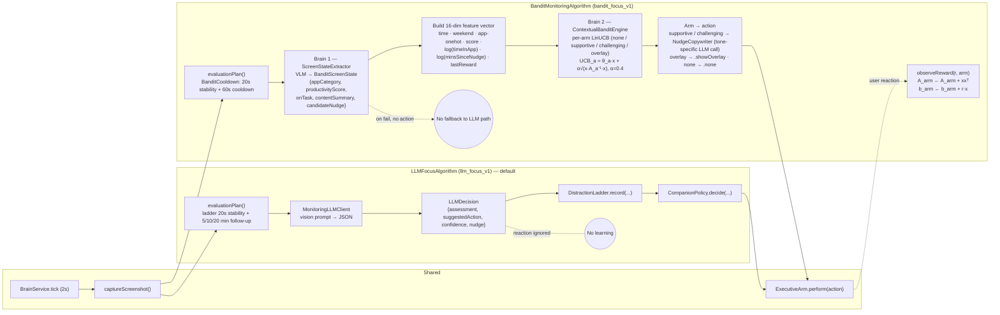
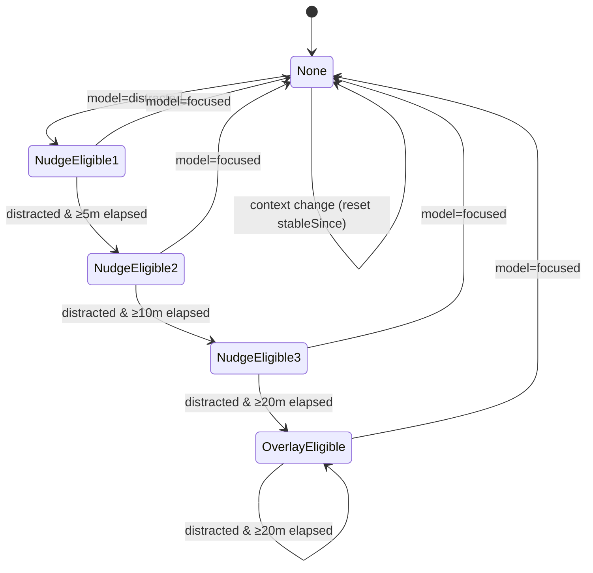
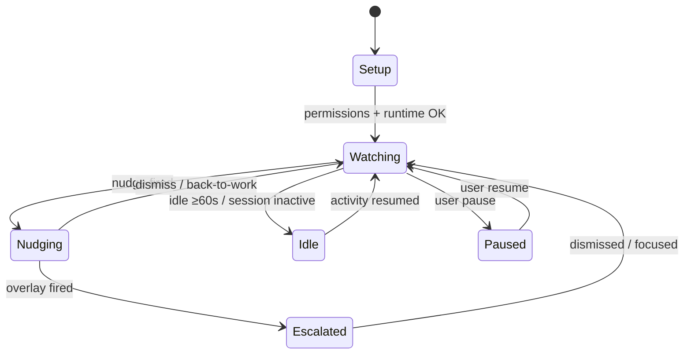
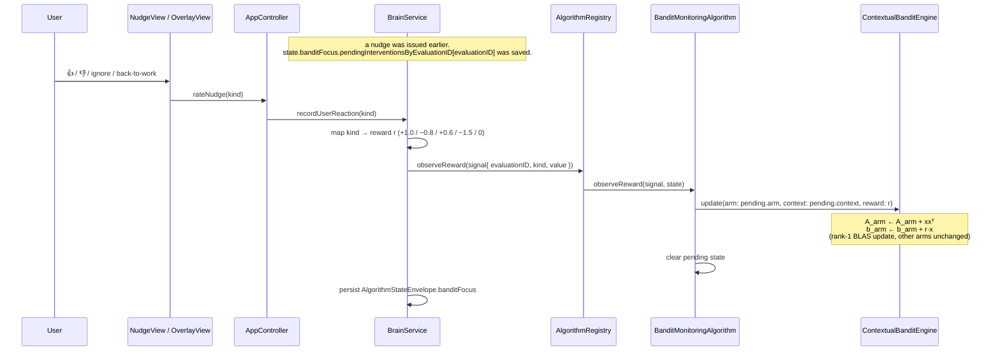

# AC — System Overview

A developer / AI onboarding reference. Two diagrams:

1. **System architecture & data flow** — what modules exist, how they wire together, how a tick travels through the app.
2. **Algorithms & state machines** — the two monitoring algorithms, the distraction ladder (LLM-only), bandit cooldown, companion mood, reward loop.

The bandit and LLM algorithms are now fully independent: no shared ladder, no fallback from one to the other. Both fit the same `MonitoringAlgorithm` seam and can be swapped at runtime.

---

## 1. System Architecture & Data Flow

### 1.1 Module map

```mermaid
flowchart TB
    subgraph Entry["Entry / Lifecycle"]
        ACApp["ACApp.swift (@main)"]
        AppDel["AppDelegate<br/>applicationDidFinishLaunching"]
        AppCtrl["AppController (singleton)<br/>state · telemetry session · UI glue"]
    end

    subgraph Runtime["Runtime loop"]
        Brain["BrainService<br/>2s tick · episode lifecycle"]
        Registry["MonitoringAlgorithmRegistry<br/>pluggable algorithm seam"]
        Exec["ExecutiveArm<br/>showNudge / showOverlay / openRescueApp"]
    end

    subgraph LLMPath["LLM algorithm (llm_focus_v1 — default)"]
        LLMAlgo["LLMFocusAlgorithm"]
        Ladder["DistractionLadder<br/>spam-prevention FSM (LLM-only)"]
        Policy["CompanionPolicy<br/>confidence gate (0.60) → action"]
        LLMClient["MonitoringLLMClient<br/>vision prompt → parsed JSON"]
    end

    subgraph BanditPath["Bandit algorithm (bandit_focus_v1)"]
        BanditAlgo["BanditMonitoringAlgorithm"]
        Cooldown["BanditCooldown<br/>stability 20s · inter-intervention 60s"]
        Extractor["ScreenStateExtractorService<br/>Brain 1 — VLM extraction"]
        Engine["ContextualBanditEngine<br/>multi-arm LinUCB (16-dim, Accelerate BLAS)"]
        Copywriter["NudgeCopywriterService<br/>tone-specific text-only LLM call"]
    end

    subgraph Services["Shared services"]
        Snap["SnapshotService<br/>frontmost app · screenshot · idle"]
        Runtime2["LocalModelRuntime<br/>llama.cpp subprocess"]
        Chat["CompanionChatService"]
        Mem["MemoryService<br/>extract · compress"]
        Prompts["PromptCatalog<br/>Resources/Prompts/*"]
        Perm["PermissionService"]
        Setup["RuntimeSetupService<br/>DependencyInstallerService"]
    end

    subgraph Persistence["Persistence"]
        Store["StorageService<br/>~/Library/Application Support/AC/state.json"]
        Tele["TelemetryStore (ACShared)<br/>JSONL + artifacts"]
        Idx["TelemetryIndexStore (ACInspector)<br/>SQLite index"]
    end

    subgraph UI["UI"]
        WinC["WindowCoordinator"]
        Content["ContentView / ChatView"]
        Orb["CompanionView (orb)"]
        Nudge["NudgeView"]
        Overlay["OverlayView"]
    end

    ACApp --> AppDel --> AppCtrl
    AppCtrl --> Brain
    AppCtrl --> Store
    AppCtrl --> Tele
    AppCtrl --> WinC
    AppCtrl --> Chat
    AppCtrl --> Mem

    Brain --> Registry
    Registry --> LLMAlgo
    Registry --> BanditAlgo

    LLMAlgo --> LLMClient --> Runtime2
    LLMAlgo --> Ladder --> Policy

    BanditAlgo --> Extractor --> Runtime2
    BanditAlgo --> Engine
    BanditAlgo --> Copywriter --> Runtime2
    BanditAlgo --> Cooldown

    Brain --> Snap
    Brain --> Exec --> WinC
    WinC --> Orb
    WinC --> Nudge
    WinC --> Overlay
    WinC --> Content

    LLMClient --> Prompts
    Extractor --> Prompts
    Copywriter --> Prompts
    Chat --> Runtime2
    Mem --> Runtime2

    Brain --> Tele
    Idx -. reads .-> Tele

    AppCtrl --> Perm
    AppCtrl --> Setup
```



**Key directories**

| Path | Purpose |
|---|---|
| [AC/Core](AC/Core) | Runtime orchestration, algorithms, policy, cooldown, ladder |
| [AC/Services](AC/Services) | Inference runtime, snapshot, storage, prompts, chat, memory, copywriter |
| [AC/Models](AC/Models) | `ACState`, `AlgorithmStateEnvelope`, decision types |
| [AC/UI](AC/UI) | SwiftUI views + `WindowCoordinator` (NSPanel/popover) |
| [AC/Resources/Prompts](AC/Resources/Prompts) | Versioned prompt assets (Monitoring / Extraction / Nudge / Chat / Memory) |
| [ACShared/Telemetry](ACShared/Telemetry) | JSONL event schema + store (shared with Inspector) |
| [ACInspector](ACInspector) | Separate app: SQLite index over telemetry for browsing |
| [docs/](docs) | `architecture.md`, `runtime.md`, `system-overview.md` |

### 1.2 Request/response data flow (one tick)

```mermaid
sequenceDiagram
    autonumber
    participant T as Timer (2s)
    participant B as BrainService
    participant S as SnapshotService
    participant R as AlgorithmRegistry
    participant A as Algorithm (LLM | Bandit)
    participant LR as LocalModelRuntime (llama.cpp)
    participant E as ExecutiveArm
    participant W as WindowCoordinator
    participant Tl as TelemetryStore

    T->>B: tick()
    B->>S: frontmostContext() / idle seconds
    B->>R: noteContext(ctx)  (resets ladder OR cooldown window)
    B->>R: evaluationPlan()  (per-algorithm gate)
    alt should evaluate
        B->>S: captureScreenshot()
        B->>Tl: observation + modelInputSaved
        B->>A: evaluate(snapshot, state)
        note over A,LR: LLM path: one vision call returns verdict.<br/>Bandit path: Brain 1 extract → pick arm → Brain 2 craft nudge (if arm is .supportiveNudge / .challengingNudge).
        A->>LR: inference(s)
        LR-->>A: stdout (JSON)
        A-->>B: CompanionAction + PolicyDecisionRecord
        B->>Tl: modelOutput / policy / action events
        B->>E: perform(action)
        E->>W: showNudge / showOverlay
    end
    Note over B,Tl: later — user taps 👍/👎 or switches app
    B->>R: observeReward(signal)  (Bandit updates A_arm, b_arm; LLM no-op)
    B->>Tl: userReaction event
```

### 1.3 Algorithm seam

Both algorithms implement `MonitoringAlgorithm` ([AC/Core/MonitoringAlgorithm.swift](AC/Core/MonitoringAlgorithm.swift)); `MonitoringAlgorithmRegistry` resolves the active one from `ACState.monitoringConfiguration.algorithmID`. The runtime loop is algorithm-agnostic — no code in `BrainService` branches on algorithm id. Each algorithm returns its own fully-assembled `CompanionPolicyResult` (action + telemetry record), so the bandit no longer has to route through `CompanionPolicy.decide()` (which is ladder-centric and LLM-specific).

### 1.4 Algorithm independence

| Concern | LLM algorithm | Bandit algorithm |
|---|---|---|
| Perception | Single vision call (prompt returns verdict) | Brain 1 VLM extraction → structured `BanditScreenState` |
| Anti-spam | `DistractionLadder` FSM (5/10/20 min ladder) | `BanditCooldown` (20 s stability + 60 s inter-intervention) |
| Decision | `CompanionPolicy.decide(...)` — confidence + ladder gate | `ContextualBanditEngine.selectArm(...)` — multi-arm UCB |
| Nudge text | VLM writes `nudge` field directly | `NudgeCopywriterService` (tone-specific text-only LLM call) with VLM's `candidateNudge` as fallback |
| Learning | None | LinUCB per arm (rank-1 BLAS updates) |
| Cross-deps | None into bandit code paths | None into LLM code paths (no fallback) |

On extraction failure the bandit yields `.none` with `blockReason = "extraction_failed"` and waits for the next stable window — it does **not** fall back to the LLM path. This keeps telemetry unambiguous about which algorithm actually decided.

### 1.5 Persistence

- **User/app state** — single JSON blob at `~/Library/Application Support/AC/state.json` via [StorageService](AC/Services/StorageService.swift). Contains `ACState`: permissions, goals, memory, chat history, recent actions/switches, usage-by-day, plus `AlgorithmStateEnvelope` with per-algorithm slices:
  - `llmFocus` — distraction ladder metadata (LLM-only).
  - `banditFocus` — engine state (per-arm A/b), pending-arm for reward attribution, per-context intervention timestamps, current-context tracking for the cooldown window.
- **Telemetry** — append-only JSONL per session under `…/AC/telemetry/<sessionID>/events.jsonl`, with screenshots/prompts/stdouts as sibling artifacts.
- **Inspector index** — ACInspector builds a derived SQLite index for fast browsing.

### 1.6 LLM integration

Local `llama.cpp` subprocess (default model `unsloth/gemma-4-E2B-it-GGUF:Q4_0`) invoked by [LocalModelRuntime](AC/Services/LocalModelRuntime.swift). Prompts are versioned assets under [AC/Resources/Prompts](AC/Resources/Prompts):

| Use | Asset |
|---|---|
| LLMFocusAlgorithm vision | `Monitoring/focus_default_v2/{vision,fallback}_{system,user}.md` |
| Bandit Brain 1 extraction | `Extraction/screen_state_v1/{system,user_prompt}.md` |
| Bandit Brain 2 nudge copy (per tone) | `Nudge/{supportive,challenging}_{system,user}.md` |
| Companion chat | `Chat/companion_chat_v1.md` |
| Memory extract/compress | `Memory/{extract,compress}_memory_v1.md` |

Nudge copywriter prompts live only on disk (no inline fallback) — if they're missing, the copywriter returns nil and the bandit falls back to the VLM's `candidateNudge`.

---

## 2. Algorithms & State Machines

### 2.1 Side-by-side



**Where one algorithm ends and the other begins.** Nothing is shared below the `MonitoringAlgorithm` seam. The Brain 1 VLM extractor and the multi-arm LinUCB engine are bandit-only. The distraction ladder is LLM-only. Each algorithm returns a fully-built `CompanionPolicyResult`; `BrainService` just executes the action and persists the updated `AlgorithmStateEnvelope`.

**Reward mapping (BrainService → bandit):** 👍 → +1.0 · 👎 → −0.8 · productive app switch after nudge → +0.6 · overlay dismissed → −1.5 · timeout → 0. Only the bandit consumes these; the LLM algorithm inherits the default no-op `observeReward`.

### 2.2 DistractionLadder — LLM-only spam-prevention FSM



Used only by `LLMFocusAlgorithm`. With no prior distraction, the ladder requires ≥20 s context stability before evaluating; once distracted, the next evaluation waits until `nextEvaluationAt` (5 / 10 / 20 min).

### 2.3 BanditCooldown — minimal per-context anti-spam

`BanditCooldown` intentionally applies the lightest filter that keeps the bandit usable without starving its learning signal:

- **Stability window (20 s)** — a frontmost context must be stable for 20 s before the bandit evaluates. Prevents evaluations in the middle of rapid app switches.
- **Inter-intervention interval (60 s)** — after the bandit fires an intervention in a given context (bundle + window-title key), it will not fire another in *that same context* for 60 s. Any arm the engine picks during that window is forced to `.none` with `blockReason = "bandit_cooldown"`, so the cooldown event is visible in telemetry.

Heavier filtering (the 5/10/20 min ladder) belongs in the LLM algorithm, where the LLM is the decision-maker. The bandit needs enough observations — across arms and contexts — to learn preferences.

### 2.4 Multi-arm bandit — arm set

| Arm | When picked | Translation |
|---|---|---|
| `.none` | no learnable arm has UCB > 0 | `.none` (no intervention) |
| `.supportiveNudge` | highest UCB, positive, warm tone wins | `NudgeCopywriterService` → warm awareness-check text → `.showNudge` |
| `.challengingNudge` | highest UCB, positive, firm tone wins | `NudgeCopywriterService` → direct, specific text → `.showNudge` |
| `.overlay` | highest UCB, positive, overlay wins | `.showOverlay` (no copywriter call) |

`.none` is the implicit "do nothing" baseline with expected reward 0. The engine only picks a learnable arm when its UCB exceeds 0, so early exploration naturally fires interventions (exploration-dominated UCB > 0 on fresh weights) and negative rewards pull individual arms below the baseline. Each learnable arm keeps its own `A` (precision matrix, λI init) and `b` (reward vector), so preferences are learned per-arm independently.

### 2.5 Companion mood



### 2.6 Bandit reward loop in detail



The `evaluationID` is the single source of truth for reward attribution: `observeReward` is a no-op unless it matches a saved pending intervention entry. No other pending entries are cleared, and only the fired arm learns from its own outcome.

---

## 3. future work

1. **Arm set sizing.** Three learnable arms is a sensible starting point but we have no production data yet. The cooldown (60 s) limits per-context learning rate — worth revisiting once we have reward data.
2. **Cold-start exploration.** Fresh `A=λI, b=0` means every arm's UCB is exploration-dominated and > 0 — the engine picks the arm with the largest `x`-aligned ball, not a randomly chosen one. Consider an explicit ε-greedy tiebreak for the very-early regime.
